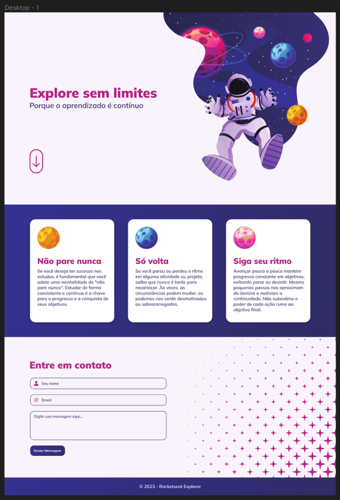

# Desafio - Explore sem limites

### Desafio do Intensivão do curso Explorer da Rocketseat.

O projeto consiste em recriar um _layout_ seguindo o arquivo do **Figma**.
### Features do projeto
- Foi criado levando em consideração a regra do mobile first
- Contém animações, transformações e transições
- Responsivo

